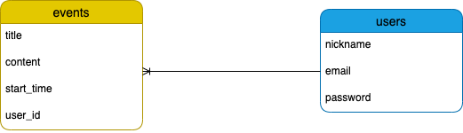
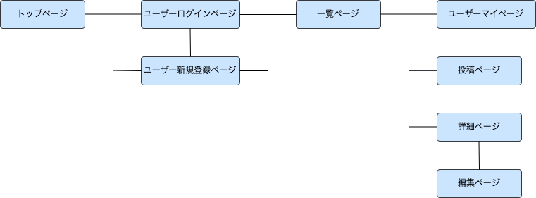

# アプリケーション名

## Share Happy

# アプリケーション概要

予定をシェアし、家族間などユーザー同士で予定を把握することで  
みんなでスケジュール管理ができてストレスなく幸せになれる

# URL

https://sharehappy38251.herokuapp.com/

# テスト用アカウント

* メールアドレス：test@test

* パスワード：test00

# 利用方法

## 予定投稿

1. トップページのはじめるボタンを押して、ユーザー新規登録画面へ遷移して登録を行う

2. 登録できたらメインページ(一覧ページ)へ遷移する  
  ヘッダーのイベントを追加ボタンから投稿画面へ遷移して予定の内容  
  (タイトル、開始時間、内容)を入力し投稿する

## 予定編集

1. メインページから予定のタイトルをクリックして予定の詳細画面へ遷移する
2. 編集ボタンを押して予定編集画面へ遷移する
3. 編集したい項目があれば、内容を編集することができる
4. 予定編集画面で、削除ボタンを押すと予定が削除されメインページから予定が消える

# アプリケーションを作成した背景

自分自身の課題や家族に課題をヒアリングした結果、「自分や子供たちの予定を共有できていない」という課題を抱えていることが判明した。自分の予定は把握できていても家族の予定が把握できていない、それにより家族の予定を何度も聞いてしまうといった問題を抱えている方も多いと考え、予定を共有し、ユーザー同士の共有の場を促進できるカレンダー機能がついたアプリケーションを開発することにした。

# 洗い出した要件

[要件を定義したシート](https://docs.google.com/spreadsheets/d/1ttft7Q1SvG5V4tg0XY9OqqgiWlRD-c4xP-H7wrGvVaI/edit?usp=sharing)

# 実装した機能についての画像やGIFおよびその説明

### トップページ  
  
### トップページから新規登録画面へ遷移  
  
### 新規登録機能  
  
### トップページからログイン画面への遷移  
  
### ログイン機能  
  
### マイページ機能  
  
### カレンダー機能  

### 予定追加機能・予定一覧機能
  
### 予定詳細機能  
  
### 予定編集機能  
  
### 予定削除機能  
  

# 実装予定の機能

現在、チャット機能を検討中  
今後は、予定ごとにその時の写真や動画を投稿できる機能を実装予定

# データベース設計

# 画面遷移図

# 開発環境  

* Bootstrap
* Ruby on Rails 6.0.0
* MySQL
* Visual Studio Code
* Git Hub

# ローカルでの動作方法

以下のコマンドを順に実行
% git clone https://github.com/lemon0922/sharehappy-38251.git  
% cd sharehappy-38251  
% bundle install  
% yarn install  

# 工夫したポイント

緑色をメインカラーとして使い、文字やボタンを緑色にしたことで利用者にとってリラックスや安らぎ、穏やかさを感じてもらえるようにした。  
また、全体的にシンプルな形にして、見やすさや使いやすさを重視した。  
simple_calenderのGemを使用して、カレンダー機能を取り入れた。  
ユーザー管理機能にはdeviseというGemを使用し、管理しやすくした。  
